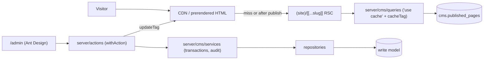

# CMS ARCHITECTURE

## Purpose
Show how the CMS is layered and how a request flows through it, for both visitors and the admin.

## Current Status
Approved and implemented.

## Shape: CQRS-lite monolith
- **Write model** (normalised, O(1) edits): `pages`, `page_sections`, `global_blocks`, `templates`, `redirects`.
- **Read model** (denormalised, O(1) reads): `published_pages`, one validated JSON document per live URL.
- **History**: `page_versions`, `global_block_versions`, `audit_log`.

## Layers and rules
| Layer | Path | May import |
|---|---|---|
| Routes (RSC) | `app/(site)`, `app/(cms)` | `server/cms` facade, components |
| Server actions | `server/actions` | services, auth, errors |
| Services | `server/cms/services` | repositories, db, registry, audit |
| Repositories | `server/cms/repositories` | db/schema |
| Queries (cached) | `server/cms/queries` | db/schema |
| Shared | `lib/cms` | nothing server-only (safe for client components) |

All `server/*` modules import `server-only`. Client components get data as props and call server actions.

## Two root layouts
- `app/(site)/layout.tsx`: the public chrome (top bar, navbar, CTA, footer). No antd.
- `app/(cms)/layout.tsx`: Ant Design registry + theme. antd's CSS-in-JS never reaches the public bundle.

## Admin rendering notes (Next 16 Cache Components)
- The admin shell awaits `connection()` inside a Suspense boundary because antd reads the clock on import and must never be prerendered.
- Suspense fallbacks are prerendered, so they are plain HTML skeletons (`PageSkeleton`, `UserMenuSkeleton`) with no antd imports.
- Catch blocks around Next APIs call `unstable_rethrow(err)` first so redirects, `notFound()` and prerender bailouts are not swallowed.

## Related
[CACHING.md](./CACHING.md), [AUTHENTICATION.md](./AUTHENTICATION.md), [DATABASE.md](./DATABASE.md), [ERROR-HANDLING.md](./ERROR-HANDLING.md), [../10-cms/CMS-OVERVIEW.md](../10-cms/CMS-OVERVIEW.md)

## Last Updated
2026-09-26
